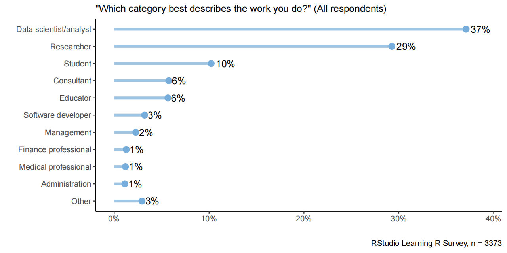
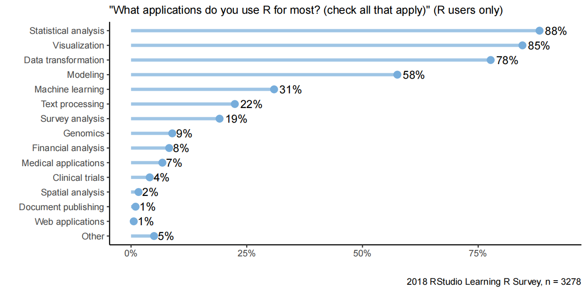
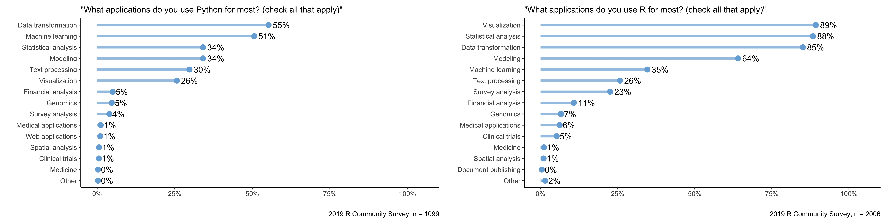
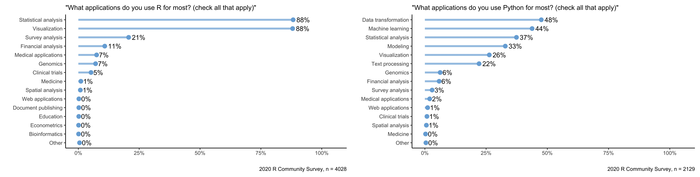
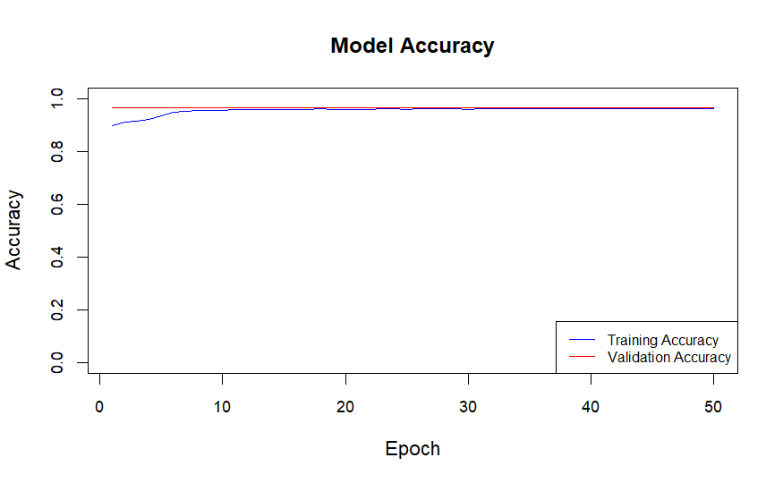
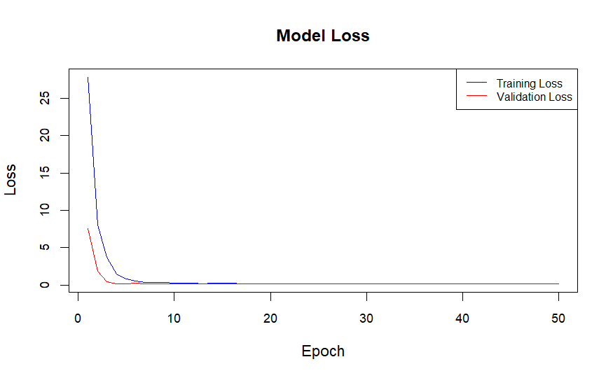
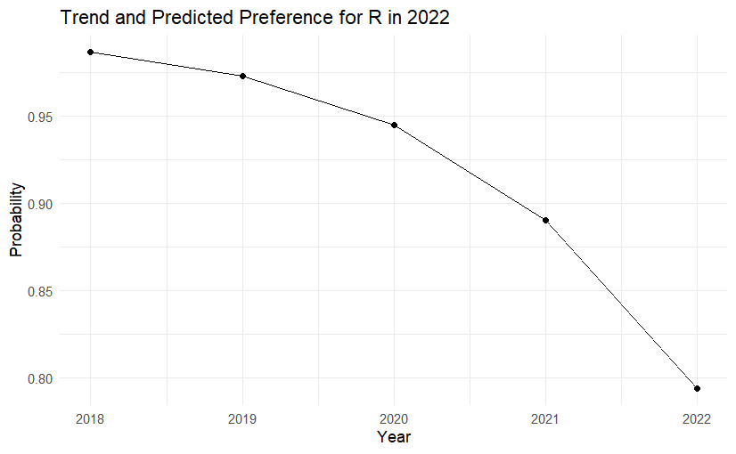

### 1. Goal

The objective of this project is to utilize the information collected
from the RStudio community survey to understand the factors influencing
the preference for R or Python among people like data scientists. And
predict the possible trend of preference of using R or Python in the
future.

```{r include=FALSE}
load("project.RData")
Sys.setenv(TF_ENABLE_ONEDNN_OPTS=0)
library(tidyverse)
library(tensorflow)
library(keras3)
```

### 2. Data Source

The primary source of data is the annual R Community Survey conducted by
RStudio, which is hosted on GitHub. Accessing this data requires cloning
the GitHub repository where the survey results are stored. Initially, I
intended to use the `use_git_clone()` function from the `usethis`
package to get the contents of the repository, but after reading the
package description, I found that this function has been removed in the
latest version. So instead I used the `clone()` function from the
`git2r` package. The data files are all in TSV format and provide
comprehensive demographic information about the survey respondents and R
usage patterns. However, the data set is not suitable for all types of
analyses; for example, respondents' answers may be self-selected or
biased towards more engaged community members, which is not always
representative of the entire R user community.

Given the nature of the data, I chose to focus on specific aspects such
as demographics, professional background, and specific R usage details
across years. I pulled from multiple annual surveys and brought them
together to create a comprehensive data set. Also, in order to process
the multilingual results, I translated all Spanish-language
questionnaires and their results so that they could be processed in
English. The processed data set contains responses from several years
and provides a solid basis for trend analysis within the R community.
Additionally, because the survey questions varied from year to year, I
had to assign different codes to process each year's results before they
could be integrated. To columns that have not appeared in other data
sets, I use NA values to fill them. Detailed data extraction and initial
processing scripts can be found in Appendix 2.1.

To analyze survey data effectively, a function has been designed that
offers various features to handle responses with considerable
flexibility. This function includes the rm.na parameter, which dictates
the treatment of NA values in the data set: setting rm.na = TRUE
excludes NA values from the calculation, ensuring that percentages are
based on non-missing responses only, whereas rm.na = FALSE includes
them, reflecting the total number of responses including missing ones.
Furthermore, the sort parameter controls the ordering of results;
setting sort = TRUE will arrange the outcomes by their frequency, while
sort = FALSE returns them in the order they appear in the data set.

Additionally, there's another function can split multiple answers
separated by commas within a single response and aggregate these into a
nested list format, facilitating detailed analysis of each individual
component of the responses. This split-and-summarize approach is
particularly useful for handling multiple-choice questions or questions
allowing multiple responses. Moreover, the function provides a feature
to extract the most frequently occurring responses, enabling users to
focus on the top 'N' results, which can be particularly insightful for
prioritizing key areas in data interpretation. This approach and its
functionalities are detailed in Appendix 2.2 of the report.

### 3. Data Processing

As shown through the code below, there are a total of 75 attributes in
the data set. Due to the specificity of the data being the result of a
questionnaire, we can't be sure which columns are important at the
beginning, so even though there are a lot of columns, we have to keep
them instead of deleting them.

```{r}
length(names(survey_combined))
```


However, for the information collected in the data set, we have to do
some processing. The first is the time information in the questionnaire,
we need to convert the `Qtime` column in the `survey`, the purpose of
which is to convert the original datetime string to a datetime object
(of type `POSIXct` or `POSIXlt` ) in R, so that it can be analysed at a
later time, in particular, here we have specified that the time zone is
the one of Auckland, New Zealand, and the before and after cases are as
follows:

```{r eval=FALSE}
est <- locale(tz = "Pacific/Auckland")
survey_combined$Qtime <-
  parse_datetime(as.character(survey1$Qtime),
                 format = "%Y/%m/%d %H:%M:%S",
                 locale = est)
```

**Before:**

```{r echo=FALSE}
head(survey_raw1$Qtime)
```

**After:**

```{r echo=FALSE}
head(survey_save1$Qtime)
```

In particular, in the 2019 survey data, the time data is formatted as
MM-DD-YYYY, so it needs to be treated separately and specially so that
the time format can be harmonised in the merger.

```{r eval=FALSE}
est <- locale(tz = "Pacific/Auckland")
survey_combined$Qtime <-
  parse_datetime(as.character(survey2$Qtime),
                 format = "%m/%d/%Y %H:%M:%S",
                 locale = est)
```

**Before:**

```{r echo=FALSE}
head(survey_raw2$Qtime)
```

**After:**

```{r echo=FALSE}
head(survey_save2$Qtime)
```

Secondly, for the open text answers to the gender question in the
questionnaire, we have to convert all the text to lower case to ensure
that all the data can be processed in a consistent format. We also
remove the whitespace before and after the strings to eliminate any
extra spaces that may occur before and after the strings due to
irregularities in typing. Finally, a regular expression `[[:punct:]]` is
used to match any punctuation and replace it with an empty string to
remove any punctuation that may affect subsequent text processing or
analysis.

```{r eval=FALSE}
survey_combined$Qgender <-
  survey_combined$Qgender %>% tolower() %>% str_trim() %>% 
  str_replace_all("[[:punct:]]", "")
opentext_gender_dictionary <-
  read_csv("dictionary/opentext_gender_dictionary.csv")
gender_dictionary <-
  opentext_gender_dictionary %>%
  mutate(Input = str_replace_all(Input, "[[:punct:]]", ""))
```

**Before:**

```{r echo=FALSE}
head(survey_raw1$Qgender)
```

**After:**

```{r echo=FALSE}
head(survey_combined$Qgender)
```

We do the same for race-related issues.

```{r eval=FALSE}
opentext_ethnicity_dictionary <-
  read_csv("dictionary/opentext_ethnicity_dictionary.csv")
ethnicity_dictionary <- opentext_ethnicity_dictionary %>%
  mutate(Input = str_replace_all(Input, "[[:punct:]]", ""))
```

**Before:**

```{r echo=FALSE}
head(survey_raw1$Qethnicity)
```

**After:**

```{r echo=FALSE}
head(survey1$Qethnicity)
```

In addition, we are going to categorise each row in the survey according
to the year in the Qr_year column and add or modify the learner_type
column to reflect the type of learner. Depending on the year, learners
will be categorised as Early Learners (between 1900 and 2016), Recent
Learners (2017 and later) or Unknown ( NA ) at very old years (less than
1900).

```{r eval=FALSE}
survey <- survey %>%
  mutate(learner_type = ifelse(
    Qr_year < 1900,
    NA,
    ifelse(Qr_year <= 2016, "Early Learner", "Recent Learner")
  ))
```

**Sample:**

```{r echo=FALSE}
tail(survey_combined$learner_type)
```

The full data processing code will be appended to 3.1.

### 4. Data Exploration

Since our main objective is to analyse and predict the preferences of a
specific population for R or Python. Like analysing which groups of
people prefer R, or which relevant factors play a bigger role in
preferring R, based on survey data obtained in the last three years. So
I'm going to start by looking at the types of work people do, and see
which groups of people use R the most, so that I can see which groups of
people are likely to have a larger share of influence on preferences.
Therefore, in this section I will choose to look at the proportional
relationship between the number of people using R and the occupations
they are in, in the form of generating graphs for the three years from
2018 to 2020. The code of this part will be included in Appendix 4.1.

_00.png){width="50%"}
{width="50%"}
_00.png){width="50%"}

We can see that from 2018 to 2020 (listed from left to right), Data
Scientists/Analysts are consistently the largest occupational group,
with a percentage of 37% of the 3,373 respondents in the first chart,
increasing to 42% of the 1,997 respondents in the second chart.
Researchers had the second highest percentage in the first chart at 29
per cent, but dropped to 24 per cent in the second chart. The percentage
of students, counsellors, and educators all declined as well. The
percentage of management and software developers remained stable, while
the percentage of healthcare professionals and financial professionals
increased slightly. Overall, the increase in the percentage of data
scientists/analysts suggests that their interest in learning about R may
be on the rise, despite the decrease in the number of participants in
the survey. Also, whether the preference is affected by gender differences is also a
part that I find more valuable to explore, as gender differences may
cause people to have different values and ways of thinking. Below are
the charts of the preferences for R by gender.

_00.png){width="50%"}_00(1).png){width="50%"}

_000(1).png){width="50%"}

The R Community Survey, conducted between 2018 and 2020, showed that
respondents who self-identified as male were in the majority in all
years, increasing slightly from 75 per cent in 2018 to 78 per cent in
2019 and 2020. The proportion of female respondents decreased from 25
per cent in 2018 to 17 per cent in the latter two years. The gender and
sexual diversity category begins to appear in 2019, accounting for 5 per
cent in both that year and 2020, and was not listed in the 2018 survey.
The number of respondents increased from 1,893 in 2019 to 4,052 in 2020,
indicating a larger survey sample and a better understanding of gender
diversity. The most critical, and I think the factor that determines whether or not
people will use R over Python, is the degree of their preference for R
to be used under a particular domain. If there is a higher preference
for Python over R for a particular application (like data
visualisation), then I think that means that people will favour Python
in that domain.

{width="50%"}

{width="100%"}

{width="100%"}

Across the 2018 to 2020 surveys, R is most frequently used for
statistical analysis and visualization, consistently scoring the highest
among other applications. Machine learning shows a higher prevalence in
Python usage compared to R. Data transformation is also common in both R
and Python, but it ranks slightly higher in Python applications. Over
the years, R maintains its stronghold in statistical analysis and
visualization while Python is preferred for machine learning tasks.
There's an observed drop in the percentage of users applying R for data
transformation from 2018 to 2020, while Python's use for data
transformation has also declined slightly in 2020.

### 5. Analytical Plan

(Implementation is shown in the results section - 6.)

The next phase of the analysis is to extend our examination of RStudio
community survey data to better understand the evolving preferences for
R and Python. This involves detailed statistical modeling and predictive
analytics to ascertain how demographic factors, industry participation,
and programming experience influence language preference. The predictors
includes responses from a diverse set of participants, varying across
industry(`Qindustry`), gender(`Qgender`), experience with
R(`Qr_experience`), their title as well as work title(`Qtitle`,
`Qwork_title`) and the year they started learning R(`Qr_year`).

First, we will create a new binary outcome, `Prefer`, based on a
weighted evaluation of respondents' enjoyment and recommendation of R
compared to Python. This nuanced view will provide insights beyond mere
usage metrics.

Secondly, to address the analytical challenges, we will build a random
forest model using the `ranger` package, which is robust to categorical
data and capable of modeling complex interactions and nonlinear
relationships.

Next, to make comparisons in the performance of different models. I'll
use the `rpart` package to build a decision tree model and use the
`tensorflow` package to build a model based on the neural network based
on the same predictors. After that, we can find out which model performs
the best.

Finally, a logistic regression model will be used to analyze the effect
of time on language preferences. By converting the `Qtime` variable into
a numeric format representing the year, this model will help reveal
trends in preference over time.

### 6. Results

Each of these predictors has been transformed into factors to ensure
they are appropriately treated in the modeling process. Missing values
within key categorical variables were replaced with randomly selected
non-missing values from the same column to maintain the integrity of the
model results. The random seed was set to ensure reproducibility of the
random replacements. The code for doing this is attached to Appendix
6.1.

```{r include=FALSE}
set.seed(251172095)
replace_na_with_random <- function(column) {
  non_na_values <- column[!is.na(column)]
  column[is.na(column)] <- sample(non_na_values, sum(is.na(column)),
                                  replace = TRUE)
  return(column)
}

survey_combined <- survey_combined %>%
  mutate(
    Qindustry = replace_na_with_random(Qindustry),
    Qr_experience = replace_na_with_random(Qr_experience),
    Qgender = replace_na_with_random(Qgender),
    Qr_year = replace_na_with_random(Qr_year),
    Qtitle = replace_na_with_random(Qtitle),
    Qwork_title = replace_na_with_random(Qwork_title)
  )

survey_combined$Qr_year <- as.factor(survey_combined$Qr_year)
survey_combined$Qgender <- as.factor(survey_combined$Qgender)
survey_combined$Qindustry <- as.factor(survey_combined$Qindustry)
survey_combined$Qr_experience <- as.factor(survey_combined$Qr_experience)
survey_combined$Qtitle <- as.factor(survey_combined$Qtitle)
survey_combined$Qwork_title <- as.factor(survey_combined$Qwork_title)
```

One significant enhancement in our approach is the creation of a new
binary outcome, `Prefer`. This outcome is based on a weighted evaluation
of respondents' enjoyment, recommendation, and usage frequency of R
compared to Python, giving us a nuanced view of preference beyond mere
usage metrics. The weightage formula used leverages enjoyment and usage
frequency more than recommendation, reflecting a more experiential bias
towards language preference. `Enjoyment`, which assesses how much users
enjoy using R or Python, is considered highly influential in determining
overall preference. It is weighted at 50% (0.5). This higher weighting
reflects the hypothesis that personal satisfaction and pleasure derived
from using a language can significantly influence one’s preference.
`Usage frequency` measures how often respondents use R or Python, and it
is weighted at 30% (0.3). This reflects the idea that frequent usage
indicates a higher comfort level and preference for the language. I
encode the data from `Q_r_how_often_used` and `Qpython_use` to get the
frequency. The coding for usage frequency is as follows: "More than once
a day": 1.0, "Between once a day and once a week": 0.75, "Between once a
week and once a month": 0.5, "Less than once a month": 0.25, "I don't
use R/Python any more": 0, For any situation else: randomly pick one
from [0, 0.25, 0.5, 0.75, 1]. `Recommendation`, which measures the
likelihood of respondents recommending R or Python to others, is given a
slightly lower weight of 20% (0.2), under the assumption that while
recommendation is important, it might be more influenced by external
factors such as community support or industry trends, rather than
personal preference. If the weighted sum for R is greater than or equal
to the weighted sum for Python, then `Prefer` is set to 1. This
indicates a preference for R over Python. Conversely, if the weighted
sum for R is less than the weighted sum for Python, `Prefer` is set to
-1, indicating a preference for Python. The code for this calculation is
attached to Appendix 6.2.

```{r include=FALSE}
survey_combined <- survey_combined %>%
  mutate(
    Qr_how_often_used = replace_na_with_random(Qr_how_often_used),
    Qpython_use = replace_na_with_random(Qpython_use),
    Qr_enjoyment = replace_na_with_random(Qr_enjoyment),
    Qrecommend = replace_na_with_random(Qrecommend),
    Qpython_enjoy = replace_na_with_random(Qpython_enjoy),
    Qpython_recommend = replace_na_with_random(Qpython_recommend)
  )

survey_combined$Qr_how_often_used <- case_when(
  survey_combined$Qr_how_often_used == "More than once a day" ~ 1.0,
  survey_combined$Qr_how_often_used == "Between once a day and once a week" ~
    0.75,
  survey_combined$Qr_how_often_used == "Between once a week and once a month" ~
    0.5,
  survey_combined$Qr_how_often_used == "Less than once a month" ~ 0.25,
  survey_combined$Qr_how_often_used == "I don't use R any more" ~ 0,
  TRUE ~ sample(c(0, 0.25, 0.5, 0.75, 1.0), 1)
)

survey_combined$Qpython_use <- case_when(
  survey_combined$Qpython_use == "I don't use Python" ~ 0,
  survey_combined$Qpython_use == "Occasionally -- less than once a month" 
  ~ 0.25,
  survey_combined$Qpython_use == 
    "Monthly -- between once a week and once a month" ~ 0.5,
  survey_combined$Qpython_use == "Weekly -- Between once a day and once a week" 
  ~ 0.75,
  survey_combined$Qpython_use == "Daily -- Once or more per day" ~ 1.0,
  TRUE ~ sample(c(0, 0.25, 0.5, 0.75, 1.0), 1)
)

survey_combined$Prefer <- case_when(
  survey_combined$Qr_enjoyment * 0.5 + survey_combined$Qrecommend * 0.2 +
    survey_combined$Qr_how_often_used * 0.3 >=
    survey_combined$Qpython_enjoy * 0.5 + survey_combined$Qpython_recommend *
    0.2 + survey_combined$Qpython_use * 0.3 ~ 1,
  survey_combined$Qr_enjoyment * 0.5 + survey_combined$Qrecommend * 0.2 +
    survey_combined$Qr_how_often_used * 0.3 <
    survey_combined$Qpython_enjoy * 0.5 + survey_combined$Qpython_recommend *
    0.2 + survey_combined$Qpython_use * 0.3 ~ -1
)

survey_combined$Prefer <- as.factor(survey_combined$Prefer)
```

Here I split the data into train and test sets, and implement a random
forest model below. The code of generating this model will be attached
to Appendix 6.3.

```{r}
colnames(survey_combined) <- make.names(colnames(survey_combined))
train_idx <- sample(nrow(survey_combined), 0.8*nrow(survey_combined))
train_data <- survey_combined[train_idx, ]
test_data <- survey_combined[-train_idx, ]
```

**Random Forest**

```{r echo=FALSE}
library(ranger)

fit.rf <- ranger(
  Prefer ~ Qr_experience + Qindustry + Qr_year + Qgender + Qtitle + Qwork_title,
  data = train_data,
  importance = 'impurity',
  classification = TRUE,
  verbose = FALSE
)

fit.rf
importance(fit.rf)

rf_predictions <- predict(fit.rf, data = test_data)
conf_matrix_rf <- table(actual = test_data$Prefer, pred = rf_predictions$predictions)
conf_matrix_rf
rf_accuracy <- sum(rf_predictions$predictions == test_data$Prefer) / nrow(test_data)
print(paste("Random Forest Accuracy:", rf_accuracy))
```

The Random Forest model performed very well in classifying the Prefer
variable with high accuracy (95.60%). In all the predictions, only a few
negative categories (-1) were misclassified as positive (1) and
similarly a few positive categories (1) were misclassified as negative
(-1). `Qtitle` variable contributed the most to the model, followed by
`Qindustry` and `Qr_year`, which played a key role in the prediction of
Prefer. `Qgender` had a lesser impact on the results. The next is Tree
model. The code of generating this model will be attached to Appendix
6.4.

**Tree**

```{r echo=FALSE}
library(rpart)

fit.tree <- rpart(
  Prefer ~ Qr_experience + Qindustry + Qr_year + Qgender + Qtitle + Qwork_title,
  data = train_data,
  method = "class",
)

fit.tree$variable.importance

tree_predictions <- predict(fit.tree, test_data, type = "class")
conf_matrix_tree <- table(actual = test_data$Prefer, pred = tree_predictions)
conf_matrix_tree
tree_accuracy <- sum(tree_predictions == test_data$Prefer) / nrow(test_data)
print(paste("Tree Accuracy:", tree_accuracy))
```

The decision tree model also showed `Qtitle` as the most important
variable compared to the random forest model. However, the Random Forest
model performed better in terms of variable importance scores and
classification accuracy, especially in terms of higher variable
importance scores and lower misclassification rates. `Qgender` still
does not play a significant role in it. The next is a neural network
model. The code of generating this model will be attached to Appendix
6.5.

**Neural Network**

In the data preprocessing stage, use `mutate_if` to convert factor and
character variables to numeric types to suit the input requirements of
the neural network. The neural network model consists of the following
components: Input layer: has the same number of nodes as the number of
input features. Hidden layer: the first layer has 64 nodes, the
activation function is relu and a dropout of 40% is used to prevent
overfitting. The second layer has 32 nodes with an activation function
of relu and a dropout of 30%. Output layer: 3 nodes, corresponding to
the triple classification task, with a softmax activation function. When
compiling the model, sparse_categorical_crossentropy is used as the loss
function, since the target variable is a category label in integer form.
The optimiser is chosen as adam, which is an adaptive learning rate
optimisation algorithm for dealing with complex neural network models.
The evaluation metric is chosen as accuracy. When training the model,
the number of training rounds (epochs) is set to 50, the batch size is
set to 32, and the validation split is set to 20%.

```{r echo=FALSE, message=FALSE, warning=FALSE}
# Preprocess the data for neural network
train_data_nn <- train_data %>%
  mutate_if(is.factor, as.numeric) %>%
  mutate_if(is.character, as.numeric)

test_data_nn <- test_data %>%
  mutate_if(is.factor, as.numeric) %>%
  mutate_if(is.character, as.numeric)

# Define the input and output
x_train <- as.matrix(train_data_nn %>% select(Qr_experience, Qindustry, Qr_year, Qgender, Qtitle, Qwork_title))
y_train <- as.numeric(train_data_nn$Prefer)
x_test <- as.matrix(test_data_nn %>% select(Qr_experience, Qindustry, Qr_year, Qgender, Qtitle, Qwork_title))
y_test <- as.numeric(test_data_nn$Prefer)

# Define the neural network model
model <- keras_model_sequential() %>%
  layer_dense(units = 64, activation = 'relu', input_shape = ncol(x_train)) %>%
  layer_dropout(rate = 0.4) %>%
  layer_dense(units = 32, activation = 'relu') %>%
  layer_dropout(rate = 0.3) %>%
  layer_dense(units = 3, activation = 'softmax')

# Compile the model
model %>% compile(
  loss = 'sparse_categorical_crossentropy',
  optimizer = optimizer_adam(),
  metrics = c('accuracy')
)

# Fit the model
history <- model %>% fit(
  x_train, y_train,
  epochs = 50,
  batch_size = 32,
  validation_split = 0.2,
  verbose = 0
)

# Evaluate the model
nn_accuracy <- model %>% evaluate(x_test, y_test)
print(paste("Neural Network Accuracy:", nn_accuracy$accuracy))
```

{width="40%"}{width="40%"}

The result is better than the Random Forest model and the decision tree
model, and the fitting is fast in no more than 15 epochs.

**Logistic Regression**

Further, a logistic regression model was used to analyze the effect of
time on language preferences. By converting the `Qtime` variable into a
numeric format that represents the year, we incorporated this as a
predictor in our logistic regression model. This model revealed a strong
negative trend in the preference for R over time, suggesting a potential
shift towards Python as years progress. The code of the model will be in
Appendix 6.6.

```{r echo=FALSE}
survey_combined$YearFromTime <- as.numeric(format(survey_combined$Qtime, "%Y"))
survey_combined$YearFromTime <- as.numeric(survey_combined$YearFromTime)
model_time <- glm(Prefer ~ YearFromTime, family = binomial(),
                  data = survey_combined)
summary(model_time)

future_year <- data.frame(YearFromTime = 2022)
future_prediction <- predict(model_time, newdata = future_year,
                             type = "response")
predicted_probability <- as.numeric(future_prediction)
print(paste(
  "Predicted probability of preferring R in 2022:",
  predicted_probability
))
```

Predictive analytics were then employed to forecast preferences for
2022. The logistic model's results indicated a notable decline in
preference for R, projecting a significant likelihood of preferring R in
2022 at around 79.3%. This suggests a stabilization or slight rebound in
preference for R despite previous declines, potentially due to evolving
features or community dynamics. The plot code will be in Appendix 6.7.

{width="40%"}

Visualization of these trends was performed using ggplot2, highlighting
the decline and the predicted stabilization in R preference. This visual
representation not only confirms the numerical findings but also
provides an easily interpretable view of how preferences might shift in
the near future.

### 7. Disscussion

In our analysis of the RStudio community survey data to discern preferences for R versus Python, several strengths and limitations are evident, each influencing our ability to effectively meet the project goals.

**Strengths:**

Comprehensive Demographic and Professional Data: The dataset includes a wide range of demographic and professional background information, which enables a detailed cohort analysis across different industry sectors and experience levels. This richness in data allows us to identify nuanced patterns and preferences among various subgroups.

Weighted Preference Calculations: By incorporating a weighted evaluation of respondents' enjoyment, recommendation, and usage frequency of R compared to Python, our approach provides a more nuanced view of preference. This method goes beyond mere usage metrics, enabling a more refined understanding of language favorability.

Temporal Dimension: The dataset spans several years, allowing for a robust analysis of trends over time. This temporal aspect helps us understand how preferences have evolved and can provide insights into future trends.

Variety of Analytical Methods: We employed various analytical methods, including random forest, decision tree, and neural network models. Each method offers unique strengths in handling the data, providing different perspectives on the factors influencing language preference.

**Limitations:**

Self-Selection Bias: The dataset is derived from a self-selected group of survey respondents, potentially introducing a bias toward those more engaged in the RStudio community or more passionate about programming languages. This may not be representative of the broader population of users, skewing the preference data towards more experienced users or those with specific professional inclinations.

Data Imputation and Translation: The translation of responses from Spanish and the handling of open-ended responses introduce complexities in data consistency and interpretation. Missing data, particularly in key variables like Qr_enjoyment and Qrecommend, needed to be imputed, which can affect the accuracy of the derived preference indicator.

Binary Outcome Simplification: The binary outcome created for logistic regression (prefer R over Python) simplifies the complex continuum of preference and may not capture subtler shifts in attitudes. This reduction can lead to an oversimplified understanding of preferences, missing out on more granular insights.

Survey Design Changes: Annual changes in survey design and question phrasing can impact the comparability of data year-over-year. Such changes can complicate trend analyses and longitudinal studies, as differences in survey design may introduce variability that is not related to actual changes in preferences.

Potential Overfitting: The high accuracy of models like the random forest and neural network may indicate potential overfitting, particularly if the models are not sufficiently validated. Overfitting can lead to models that perform well on training data but poorly on unseen data.

In summary, while the RStudio community survey data provides a rich and detailed source of information for analyzing preferences for R versus Python, careful consideration of its limitations is essential. Addressing these limitations through robust data handling and validation techniques is crucial for deriving accurate and generalizable insights from the analysis.

### 8. Conclusion

Overall, my project successfully analyzed preferences for R versus Python using the RStudio community survey data. The detailed cohort analysis and weighted preference calculations provided nuanced insights into language favorability, revealing interesting trends over time.

However, prediction models, while showing high accuracy, faced limitations like potential overfitting and simplification of preferences into a binary outcome. In the future, using penalized regression models or advanced neural network architectures could improve prediction accuracy and robustness.

This project lays a strong foundation for further research into programming language preferences, offering valuable insights for more sophisticated analyses with larger datasets.

### Appendices

**2.1 Acquisition and integration of survey data:**

```{r eval=FALSE}
library(choroplethr)
library(choroplethrMaps)
data(country.map)
library(tidyverse)
library(RColorBrewer)
library(gendercodeR)
library(ggrepel)
library(git2r)

#obtaining the GitHUb repository
path <- file.path("r-community-survey")
dir.create(path, recursive = TRUE)
repo <-
  clone("https://github.com/rstudio/r-community-survey.git", path)

#data of Year 2020
survey1_name <- "2020 R Community Survey"
column_formats1 <- cols(
  Qtime1 = col_datetime(),
  Qr_experience1 = col_character(),
  Qhow_to_learn_r1 = col_character(),
  Qreason_to_learn1 = col_character(),
  Qr_use1 = col_character(),
  Qtools1 = col_character(),
  Qobstacles_to_starting1 = col_character(),
  Qr_year1 = col_double(),
  Qr_learning_path1 = col_character(),
  Qr_reason_experienced1 = col_character(),
  Qmost_difficult_aspect1 = col_character(),
  Qr_how_often_used1 = col_character(),
  Qr_OS1 = col_character(),
  Qused_for1 = col_character(),
  Qr_enjoyment1 = col_double(),
  Qrecommend1 = col_double(),
  Qtools_with_r1 = col_character(),
  Qtidyverse_learning1 = col_character(),
  Qtidyverse_today1 = col_character(),
  Qlike_best1 = col_character(),
  Qlike_least1 = col_character(),
  Qr_problems1 = col_character(),
  Qr_discover_packages1 = col_character(),
  Qr_share1 = col_character(),
  Qr_change1 = col_character(),
  Qrobot_test1 = col_character(),
  Qrmarkdown1 = col_character(),
  Qrmarkdown_apps1 = col_character(),
  Qrmarkdown_change1 = col_character(),
  Qshiny1 = col_character(),
  Qshiny_use1 = col_character(),
  Qshiny_change1 = col_character(),
  Qpython_use1 = col_character(),
  Qpython_apps1 = col_character(),
  Qpython_tools1 = col_character(),
  Qpython_enjoy1 = col_double(),
  Qpython_recommend1 = col_double(),
  Qpython_change1 = col_character(),
  Qcoding_languages1 = col_character(),
  Qfirst_language1 = col_character(),
  Qyear_born1 = col_double(),
  Qgender1 = col_character(),
  Qethnicity1 = col_character(),
  Qdegree1 = col_character(),
  Qcountry1 = col_character(),
  Qindustry1 = col_character(),
  Qtitle1 = col_character(),
  Qwork_title1 = col_character(),
  Qteam_r_users1 = col_character(),
  Qr_community1 = col_character(),
  Qevents1 = col_character(),
  Qhear1 = col_character(),
  language1 = col_character()
)
survey_raw1 <- read_tsv("./data/2020-combined-survey-final.tsv",
                        col_types = column_formats1)
survey_questions1 <-
  read_tsv(("./data/2020-combined-survey-names.tsv")) %>%
  select("Question_name" = english_name, "Question_text" = english)
respondents_raw1 <- nrow(survey_raw1)
survey_non_robot1 <- survey_raw1 %>%
  mutate(robot_test1 = ifelse(!is.na(Qrobot_test), tolower(Qrobot_test), NA))
survey1 <- survey_non_robot1 %>%
  filter(!is.na(robot_test1)) %>%
  filter(
    robot_test1 == "5" |
      str_detect(robot_test1, "five") |
      robot_test1 == "cinco" | robot_test1 == "fife"
  )
respondents1 <- nrow(survey1)
survey_save1 <- survey1


#data of Year 2019
survey_name2 <- "2019 R Community Survey"
column_formats2 = cols(
  Qtime = col_character(),
  Qr_experience = col_character(),
  Qr_difficulty = col_double(),
  Qr_length_to_success = col_character(),
  Qhow_to_learn_r = col_character(),
  Qreason_to_learn = col_character(),
  Qr_use = col_character(),
  Qtools = col_character(),
  Qobstacles_to_starting = col_character(),
  Qr_year = col_double(),
  Qr_learning_path = col_character(),
  Qr_difficulty = col_double(),
  Qtime_to_proficiency = col_character(),
  Qreason_to_learn = col_character(),
  Qmost_difficult_aspect = col_character(),
  Qr_how_often_used = col_character(),
  Qused_for = col_character(),
  Qr_enjoyment = col_double(),
  Qrecommend = col_double(),
  Qtools_with_r = col_character(),
  Qtidyverse_learning = col_character(),
  Qtidyverse_today = col_character(),
  Qlike_best = col_character(),
  Qlike_least = col_character(),
  Qr_problems = col_character(),
  Qr_discover_packages = col_character(),
  Qr_share = col_character(),
  Qr_change = col_character(),
  Qrobot_test = col_character(),
  Qrmarkdown = col_character(),
  Qrmarkdown_apps = col_character(),
  Qrmarkdown_change = col_character(),
  Qshiny = col_character(),
  Qshiny_change  = col_character(),
  Qpython_use = col_character(),
  Qpython_apps = col_character(),
  Qpython_enjoy = col_double(),
  Qpython_recommend = col_double(),
  Qpython_change = col_character(),
  Qlanguages  = col_character(),
  Qfirst_language = col_character(),
  Qyear_born = col_double(),
  Qgender  = col_character(),
  Qethnicity  = col_character(),
  Qdegree  = col_character(),
  Qcountry  = col_character(),
  Qindustry  = col_character(),
  Qtitle  = col_character(),
  Qwork_title  = col_character(),
  Qteam_r_users = col_character(),
  Qevents  = col_character(),
  Qhear  = col_character()
)
english_column_names <-
  read_tsv("./data/survey-questions-2019-en.tsv")
english_survey <-
  read_tsv(
    file = "./data/2019 English R Community Survey Responses.tsv",
    col_types = column_formats2,
    col_names = english_column_names$Question_name,
    skip = 1
  )
names(english_survey) <- english_column_names$Question_name
english_survey$language <- "English"
spanish_survey <-
  read_tsv(
    "./data/2019 Spanish R Community Survey Responses.tsv",
    col_types = column_formats2,
    col_names = english_column_names$Question_name,
    skip = 1
  )
names(spanish_survey) <- english_column_names$Question_name
spanish_survey$language <- "Spanish"
survey_raw2 <- rbind(english_survey, spanish_survey)
survey_questions2 <-
  read_tsv("./data/survey-questions-2019-en.tsv")
respondents_raw2 <- nrow(survey_raw2)
survey2 <- survey_raw2 %>%
  mutate(robot_test = str_to_lower(Qrobot_test)) %>%
  filter(!is.na(robot_test)) %>%
  filter(robot_test == "8" |
           robot_test == "eight" | robot_test == "ocho")
respondents2 <- nrow(survey2)
survey_save2 <- survey2

#data of Year 2018
survey_name3 <- "2018 RStudio Learning R Survey"
column_formats3 = cols(
  Qtime = col_datetime(format = ""),
  Qindustry = col_character(),
  Qtitle = col_character(),
  Qwork_title = col_character(),
  Qlanguages = col_character(),
  Qfirst_language = col_character(),
  Qr_experience = col_character(),
  Qr_year = col_double(),
  Qtime_to_proficiency = col_character(),
  Qr_learning_path = col_character(),
  Qreason_to_learn = col_character(),
  Qr_use = col_character(),
  Qr_length_to_success = col_character(),
  Qr_difficulty = col_double(),
  Qr_reason_experienced = col_character(),
  Qr_how_often_used = col_character(),
  Qr_enjoyment = col_double(),
  Qr_difficulty_experienced = col_double(),
  Qtidyverse_learning = col_character(),
  Qtidyverse_today = col_character(),
  Qshiny = col_character(),
  Qunit_tests = col_character(),
  Qlike_best = col_character(),
  Qlike_least = col_character(),
  Qrecommend = col_double(),
  Qused_for = col_character(),
  Qmost_difficult_aspect = col_character(),
  blank_question = col_character(),
  Qnot_live_without = col_character(),
  Qcapability_missing = col_character(),
  Qtools = col_character(),
  Qchange_one_thing = col_character(),
  Qyear_born = col_double(),
  Qgender = col_character(),
  Qcountry = col_character(),
  Qethnicity = col_character(),
  Qdegree = col_character(),
  Qteam_r_users = col_double(),
  Qversion_control = col_character(),
  Qtools_with_r = col_character(),
  Qobstacles_to_starting = col_character(),
  Qbiggest_difficulty = col_character(),
  Qhow_to_learn_r = col_character(),
  learner_type = col_character(),
  Qgender_coded = col_character(),
  Qethnicity_processed = col_character(),
  Qethnicity_coded = col_character(),
  number_responses = col_double()
)
english_survey <- read_tsv("data/survey_English.tsv",
                           col_types = column_formats3)
english_survey$language <- "English"
spanish_survey <- read_tsv("data/survey_Spanish.tsv",
                           col_types = column_formats3)
spanish_survey <- spanish_survey %>% select(-blank2_question)
spanish_survey$language <- "Spanish"
survey3 <- rbind(english_survey, spanish_survey)
survey_questions3 <- read_csv("data/survey_questions.csv")
respondents3 <- nrow(survey3)

#data set merge
library(plyr)
survey_combined <- rbind.fill(survey1, survey2, survey3)
```

**2.2 Multiple functions used to pre-process survey data:**

```{r eval=FALSE}
# This tallies up the results for a question
# rm.na = TRUE to calculate percentages based on non-NA results; set to FALSE 
# to include NAs
# set sort = TRUE sorts the result by count; set to FALSE to return in whatever 
# order they occur
tally_question <-
  function(df,
           question_name,
           rm.na = TRUE,
           sort = TRUE) {
    quoted_question <- enquo(question_name)
    filtered_df <- df
    if (rm.na) {
      filtered_df <- filtered_df %>%
        filter(!is.na(!!quoted_question))
    }
    results_df <- filtered_df %>%
      count(!!quoted_question, sort = sort) %>%
      add_tally(n, name = "nn") %>%
      mutate(percent = round(n / nn * 100, 1),
             prop_responses = n / nn)
    return(results_df)
  }
# This tallies up the results for a question
# rm.na = TRUE to calculate percentages based on non-NA results; set to 
# FALSE to include NAs
# set sort = TRUE sorts the result by count; set to FALSE to return in whatever 
# order they occur
tally_question_by_question <-
  function(df,
           question_name,
           by_question_name,
           # column name to group by
           rm.na = TRUE,
           sort = TRUE) {
    quoted_question <- enquo(question_name)
    quoted_by_question <- enquo(by_question_name)
    filtered_df <- df
    if (rm.na) {
      filtered_df <- filtered_df %>%
        filter(!is.na(!!quoted_question))
    }
    results_df <- filtered_df %>%
      count(!!quoted_question, sort = sort) %>%
      add_tally(n, name = "nn") %>%
      mutate(percent = round(n / nn * 100, 1),
             prop_responses = n / nn)
    return(results_df)
  }
# Split and aggregate: derives multiple answers to a single question 
# by separating on commas and returning
# the results as an embedded list in the dataframe.
split_and_aggregate <- function(df, question_name) {
  quoted_question <- enquo(question_name)
  responses_df <- df %>%
    summarize(responses = sum(!is.na(!!quoted_question)))
  splits <- df %>%
    mutate(items = purrr::map(!!quoted_question, str_split, ", ")) %>%
    unnest(items)
  aggregated_items <- splits %>%
    unnest(items) %>%
    group_by(items) %>%
    count(sort = TRUE)
  aggregated_items <- aggregated_items %>%
    mutate(num_responses = responses_df$responses)
  return(aggregated_items)
}
# Top N choices: function to distill many possible results 
# to a question to the top N
# responses, with the rest aggregated into an "Other" answer.
top_n_choices <-
  function(df, column_name, total_responses, num = 10) {
    quoted_column_name <- enquo(column_name)
    summarized_responses <- df %>%
      mutate(
        percent = round(n / total_responses * 100, 1),
        prop_responses = n / total_responses
      ) %>%
      arrange(desc(percent))
    # Now take these responses and only show the top N, aggregating the rest 
    # into an Other category
    literals <- head(summarized_responses, num) %>%
      ungroup()
    other <- tail(summarized_responses, -num) %>%
      ungroup() %>%
      summarize(
        !!quoted_column_name := "Other",
        n = sum(n),
        percent = round(n / first(total_responses) * 100, 1),
        prop_responses = n / first(total_responses)
      )
    top_n <- rbind(literals, other) %>% drop_na()
    return(top_n)
  }
question_text <-
  function(question_name_string,
           respondents_note = "",
           wrap_length = 55)
  {
    qtext <-
      survey_questions %>% filter(Question_name == question_name_string) %>%
      select(Question_text)
    if (str_length(qtext$Question_text) >= wrap_length) {
      return_text <-
        qtext$Question_text %>% str_wrap(width = wrap_length - 5)
    } else {
      return_text <- qtext$Question_text
    }
    return(paste0('"', return_text, '" ', respondents_note))
  }
```

**3.1 Processing the survey:**

```{r eval=FALSE}
survey1 <- survey_save1
est <- locale(tz = "Pacific/Auckland")
survey1$Qtime <-
  parse_datetime(as.character(survey1$Qtime),
                 format = "%m/%d/%Y %H:%M:%S",
                 locale = est)
survey1 <- survey1 %>%
  mutate(learner_type = ifelse(
    Qr_year < 1900,
    NA,
    ifelse(Qr_year <= 2016, "Early Learner", "Recent Learner")
  ))
survey1$Qgender <-
  survey1$Qgender %>% tolower() %>% str_trim() %>% 
  str_replace_all("[[:punct:]]", "")
opentext_gender_dictionary <-
  read_csv("dictionary/opentext_gender_dictionary.csv")
gender_dictionary <-
  opentext_gender_dictionary %>%  
  mutate(Input = str_replace_all(Input, "[[:punct:]]", ""))
source("gendercoder/R/genderCode.R")
survey1 <-
  genderRecode(
    survey,
    method = "narrow",
    genderColName = "Qgender",
    outputColName = "Qgender_coded",
    customDictionary = gender_dictionary
  )
survey1 <-
  survey1 %>% 
  mutate(Qgender_coded = ifelse(Qgender_coded == "", NA, Qgender_coded))
uncoded_genders <-
  survey1 %>% group_by(Qgender_coded) %>% count(sort = TRUE)
write_csv(uncoded_genders, "dictionary/uncoded_genders_language.csv")
opentext_ethnicity_dictionary <-
  read_csv("dictionary/opentext_ethnicity_dictionary.csv")
ethnicity_dictionary <- opentext_ethnicity_dictionary %>%
  mutate(Input = str_replace_all(Input, "[[:punct:]]", ""))
survey1 <- survey1 %>%
  mutate(Qethnicity_processed = ifelse(
    str_detect(Qethnicity, ","),
    "Multiple Ethnicities",
    Qethnicity
  ))
survey$Qethnicity_processed <-
  survey$Qethnicity_processed %>% tolower() %>% str_trim() %>% 
  str_replace_all("[[:punct:]]", "")
survey1 <- survey1 %>%
  left_join(ethnicity_dictionary, by = c("Qethnicity_processed" = "Input"))
uncoded_ethnicities <- survey %>%
  anti_join(ethnicity_dictionary, by = c("Qethnicity_processed" = "Input")) %>%
  count(Qethnicity_processed, sort = TRUE)
write_csv(uncoded_ethnicities,
          "dictionary/uncoded_ethnicities_language.csv")
survey <- survey1 %>%
  mutate(Qethnicity_coded = ifelse(Qethnicity_coded == "Prefer not to answer",
                                   NA,
                                   Qethnicity_coded))
collected_ethnicities <-
  survey %>% group_by(Qethnicity_coded) %>% count(sort = TRUE)
```

**4.1 Plot and data analysis:**

```{r eval=FALSE}
#lollipop chart
lollipop_chart <- function(df,
                           column_name,
                           fill_color,
                           title_string = NULL,
                           subtitle_string = "",
                           caption_string = survey_name,
                           pct_accuracy = 1) {
  quoted_column <- enquo(column_name)
  nudge_amount <- max(df$prop_responses, na.rm = TRUE) * 0.05
  df <- df %>%
    mutate(xaxis_factor = suppressWarnings(fct_relevel(
      fct_reorder(!!quoted_column, prop_responses), "Other"
    )))
  p <- ggplot(df, aes(x = xaxis_factor,
                      y = prop_responses)) +
    geom_point(color = fill_color, size = 3) +
    geom_segment(
      aes(xend = fct_rev(!!quoted_column), yend = 0),
      color = fill_color,
      size = 1.5,
      alpha = .7
    ) +
    geom_text(aes(label = scales::percent(prop_responses,
                                          accuracy = pct_accuracy)),
              hjust = -.25,
              color = "black") +
    labs(
      title = title_string,
      subtitle = subtitle_string,
      caption = caption_string,
      x = "",
      y = ""
    ) +
    coord_flip() +
    scale_y_continuous(limits = c(0, max(df$n) * 1.05)) +
    scale_y_continuous(labels = scales::percent_format(accuracy = 1),
                       limits = c(0, max(df$prop_responses) * 1.05)) +
    theme(
      panel.grid.major = element_blank(),
      panel.grid.minor = element_blank(),
      panel.background = element_rect(fill = "transparent", colour = NA),
      plot.background = element_rect(fill = "transparent", colour = NA)
    )
  lollipop_chart_100pc <- function(df,
                                   column_name,
                                   fill_color,
                                   title_string = NULL,
                                   subtitle_string = "",
                                   caption_string = survey_name,
                                   pct_accuracy = 1) {
    quoted_column <- enquo(column_name)
    nudge_amount <- max(df$prop_responses, na.rm = TRUE) * 0.05
    df <- df %>%
      mutate(xaxis_factor = suppressWarnings(fct_relevel(
        fct_reorder(!!quoted_column, prop_responses), "Other"
      )))
    p <- ggplot(df, aes(x = xaxis_factor,
                        y = prop_responses)) +
      geom_point(color = fill_color, size = 3) +
      geom_segment(
        aes(xend = fct_rev(!!quoted_column), yend = 0),
        color = fill_color,
        size = 1.5,
        alpha = .7
      ) +
      geom_text(aes(label = scales::percent(prop_responses,
                                            accuracy = pct_accuracy)),
                hjust = -.25,
                color = "black") +
      labs(
        title = title_string,
        subtitle = subtitle_string,
        caption = caption_string,
        x = "",
        y = ""
      ) +
      coord_flip() +
      scale_y_continuous(labels = scales::percent_format(accuracy = 1),
                         limits = c(0, 1.05)) +
      theme(
        panel.grid.major = element_blank(),
        panel.grid.minor = element_blank(),
        panel.background = element_rect(fill = "transparent", colour = NA),
        plot.background = element_rect(fill = "transparent", colour = NA)
      )
    
    #Respondent Job
    job_title_dictionary <-
      read_delim(
        "dictionary/work-title-dictionary.tsv",
        delim = "\t",
        col_types = "cc"
      )
    job_titles <- survey %>% select(Qwork_title) %>%
      drop_na() %>%
      left_join(job_title_dictionary, c("Qwork_title" = "Input"))
    job_title_exceptions <- survey %>% select(Qwork_title) %>%
      drop_na() %>%
      anti_join(job_title_dictionary, c("Qwork_title" = "Input"))
    job_title_totals <- job_titles %>% count(Output, sort = TRUE)
    job_title_responses <- sum(!is.na(survey$Qwork_title))
    job_titles <-
      job_title_totals %>% mutate(percent = round(n /
                                                    job_title_responses * 100,
                                                  0))
    top_10_titles <-
      top_n_choices(job_titles, Output, job_title_responses, 10)
    top_10_titles <- top_10_titles %>%
      mutate(
        JobTitle = factor(Output, levels = rev(Output)),
        position = cumsum(percent) - percent / 2,
        label = ifelse(percent >= 5, paste0(JobTitle, "\n", round(percent),
                                            "%"), "")
      )
    lollipop_chart (
      df = top_10_titles,
      column_name = JobTitle,
      fill_color = params$bar_colors,
      subtitle_string = question_text("Qwork_title", "(All respondents)"),
      caption_string = paste0("RStudio Learning R Survey, n = ",
                              job_title_responses)
    )
    plot_save("Respondent Job Titles (All Respondents).pdf")
    
    #Respondent Gender
    genders <- survey_combined %>%
      group_by(Qgender) %>%
      count(sort = TRUE) %>%
      mutate(unit = 1) %>%
      drop_na()
    gender_responses <- sum(genders$n, na.rm = TRUE)
    genders <- genders %>%
      group_by(unit) %>%
      mutate(
        percent = round(n / gender_responses * 100),
        prop_responses = n / gender_responses,
        position = cumsum(percent) - percent / 2,
        label = ifelse(percent >= 10, paste0(
          Qgender_coded, "\n", round(percent), "%"
        ), "")
      ) %>%
      arrange(desc(percent))
    genders <- genders %>%
      mutate(Qgender_coded = factor(as.character(Qgender_coded), levels = rev(
        c("male", "female", "sex and gender diverse", "unclear")
      ))) %>%
      drop_na()
    lollipop_chart(
      df                 = genders,
      column_name        = Qgender_coded,
      subtitle_string    = question_text("Qgender", "(All respondents)"),
      title_string       = "",
      fill_color         = params$bar_colors,
      caption_string     = paste0(survey_name, ", n = ", gender_responses)
    )
    plot_save("Respondent Identified Genders (All Respondents).pdf",
              height = 2)
    
    #What do Python used for
    python_use_dictionary <-
      read_delim("dictionary/use_dictionary.tsv",
                 delim = "\t",
                 col_types = "cc")
    uses <-
      survey %>% mutate(application = purrr::map(Qpython_apps, str_split, ", ")) 
    %>% unnest(cols = c(application))
    apps_used <-
      uses %>% unnest(cols = c(application)) %>% select(application)
    parsed_use_used <- apps_used %>%
      left_join(python_use_dictionary, c("application" = "Input"))
    parsed_use_exceptions <- apps_used %>%
      anti_join(python_use_dictionary, c("application" = "Input"))
    use_responses <- sum(!is.na(survey$Qpython_apps))
    parsed_use_tally <- parsed_use_used %>% count(Output, sort = TRUE)
    parsed_use_tally <- parsed_use_tally %>%
      mutate(
        percent = round(n / use_responses * 100),
        prop_responses = n / use_responses
      ) %>%
      arrange(desc(percent))
    app_plot <- head(parsed_use_tally, 15) %>%
      ungroup() %>%
      arrange(prop_responses)
    other <- tail(parsed_use_tally,-15) %>%
      ungroup() %>%
      summarize(
        Output = "Other",
        n = sum(n),
        percent = round(n / use_responses * 100),
        prop_responses = n / use_responses
      )
    app_plot <- rbind(other, app_plot) %>% drop_na()
    app_plot <- app_plot %>%
      mutate(Output = factor(as.character(Output), levels = Output))
    lollipop_chart_100pc(
      app_plot,
      Output,
      fill_color = params$bar_colors,
      subtitle_string =  question_text("Qpython_apps", "", 75),
      caption = paste0(survey_name, ", n = ", use_responses)
    )
    plot_save("What Do You Use Python For.pdf")
    plot_save("What Do You Use Python For.jpg")
    
    #What do R used for
    r_use_dictionary <-
      read_delim("dictionary/use_dictionary.tsv",
                 delim = "\t",
                 col_types = "cc")
    uses <-
      survey %>% mutate(application = purrr::map(Qused_for, str_split, ", ")) 
    %>% unnest()
    apps_used <- uses %>% unnest() %>% select(application)
    parsed_use_used <- apps_used %>%
      left_join(r_use_dictionary, c("application" = "Input"))
    parsed_use_exceptions <- apps_used %>%
      anti_join(r_use_dictionary, c("application" = "Input"))
    use_responses <- sum(!is.na(survey$Qused_for))
    parsed_use_tally <- parsed_use_used %>% count(Output, sort = TRUE)
    parsed_use_tally <- parsed_use_tally %>%
      mutate(
        percent = round(n / use_responses * 100),
        prop_responses = n / use_responses
      ) %>%
      arrange(desc(percent))
    app_plot <- head(parsed_use_tally, 15) %>%
      ungroup() %>%
      arrange(prop_responses)
    other <- tail(parsed_use_tally,-15) %>%
      ungroup() %>%
      summarize(
        Output = "Other",
        n = sum(n),
        percent = round(n / use_responses * 100),
        prop_responses = n / use_responses
      )
    
    app_plot <- rbind(other, app_plot) %>% drop_na()
    app_plot <- app_plot %>%
      mutate(Output = factor(as.character(Output), levels = Output))
    lollipop_chart_100pc(
      app_plot,
      Output,
      fill_color = params$bar_colors,
      subtitle_string =  question_text("Qused_for", "", 75),
      caption = paste0(survey_name, ", n = ", use_responses)
    )
    plot_save("What Do You Use R For.pdf")
    plot_save("What Do You Use R For.jpg")
```

**6.1 Data Cleaning:**

```{r eval=FALSE}
set.seed(251172095)
replace_na_with_random <- function(column) {
  non_na_values <- column[!is.na(column)]
  column[is.na(column)] <- sample(non_na_values, sum(is.na(column)),
                                  replace = TRUE)
  return(column)
}

survey_combined <- survey_combined %>%
  mutate(
    Qindustry = replace_na_with_random(Qindustry),
    Qr_experience = replace_na_with_random(Qr_experience),
    Qgender = replace_na_with_random(Qgender),
    Qr_year = replace_na_with_random(Qr_year),
    Qtitle = replace_na_with_random(Qtitle),
    Qwork_title = replace_na_with_random(Qwork_title)
  )

survey_combined$Qr_year <- as.factor(survey_combined$Qr_year)
survey_combined$Qgender <- as.factor(survey_combined$Qgender)
survey_combined$Qindustry <- as.factor(survey_combined$Qindustry)
survey_combined$Qr_experience <- as.factor(survey_combined$Qr_experience)
survey_combined$Qtitle <- as.factor(survey_combined$Qtitle)
survey_combined$Qwork_title <- as.factor(survey_combined$Qwork_title)
```

**6.2 `Prefer` Calculation:**

```{r eval=FALSE}
survey_combined <- survey_combined %>%
  mutate(
    Qr_how_often_used = replace_na_with_random(Qr_how_often_used),
    Qpython_use = replace_na_with_random(Qpython_use),
    Qr_enjoyment = replace_na_with_random(Qr_enjoyment),
    Qrecommend = replace_na_with_random(Qrecommend),
    Qpython_enjoy = replace_na_with_random(Qpython_enjoy),
    Qpython_recommend = replace_na_with_random(Qpython_recommend)
  )

survey_combined$Qr_how_often_used <- case_when(
  survey_combined$Qr_how_often_used == "More than once a day" ~ 1.0,
  survey_combined$Qr_how_often_used == "Between once a day and once a week" ~
    0.75,
  survey_combined$Qr_how_often_used == "Between once a week and once a month" ~
    0.5,
  survey_combined$Qr_how_often_used == "Less than once a month" ~ 0.25,
  survey_combined$Qr_how_often_used == "I don't use R any more" ~ 0,
  TRUE ~ sample(c(0, 0.25, 0.5, 0.75, 1.0), 1)
)

survey_combined$Qpython_use <- case_when(
  survey_combined$Qpython_use == "I don't use Python" ~ 0,
  survey_combined$Qpython_use == "Occasionally -- less than once a month" 
  ~ 0.25,
  survey_combined$Qpython_use == 
    "Monthly -- between once a week and once a month" ~ 0.5,
  survey_combined$Qpython_use == "Weekly -- Between once a day and once a week" 
  ~ 0.75,
  survey_combined$Qpython_use == "Daily -- Once or more per day" ~ 1.0,
  TRUE ~ sample(c(0, 0.25, 0.5, 0.75, 1.0), 1)
)

survey_combined$Prefer <- case_when(
  survey_combined$Qr_enjoyment * 0.5 + survey_combined$Qrecommend * 0.2 +
    survey_combined$Qr_how_often_used * 0.3 >=
    survey_combined$Qpython_enjoy * 0.5 + survey_combined$Qpython_recommend *
    0.2 + survey_combined$Qpython_use * 0.3 ~ 1,
  survey_combined$Qr_enjoyment * 0.5 + survey_combined$Qrecommend * 0.2 +
    survey_combined$Qr_how_often_used * 0.3 <
    survey_combined$Qpython_enjoy * 0.5 + survey_combined$Qpython_recommend *
    0.2 + survey_combined$Qpython_use * 0.3 ~ -1
)

survey_combined$Prefer <- as.factor(survey_combined$Prefer)
```

**6.3 Random Forest Model:**

```{r eval=FALSE}
library(ranger)

fit.rf <- ranger(
  Prefer ~ Qr_experience + Qindustry + Qr_year + Qgender + Qtitle + Qwork_title,
  data = train_data,
  importance = 'impurity',
  classification = TRUE,
  verbose = FALSE
)

fit.rf
importance(fit.rf)

rf_predictions <- predict(fit.rf, data = test_data)
conf_matrix_rf <- table(actual = test_data$Prefer,
                        pred = rf_predictions$predictions)
conf_matrix_rf
rf_accuracy <- sum(rf_predictions$predictions == test_data$Prefer) /
  nrow(test_data)
print(paste("Random Forest Accuracy:", rf_accuracy))
```

**6.4 Decision Tree Model:**

```{r eval=FALSE}
library(rpart)

fit.tree <- rpart(
  Prefer ~ Qr_experience + Qindustry + Qr_year + Qgender + Qtitle + Qwork_title,
  data = train_data,
  method = "class",
)

fit.tree$variable.importance

tree_predictions <- predict(fit.tree, test_data, type = "class")
conf_matrix_tree <- table(actual = test_data$Prefer, pred = tree_predictions)
conf_matrix_tree
tree_accuracy <- sum(tree_predictions == test_data$Prefer) / nrow(test_data)
print(paste("Tree Accuracy:", tree_accuracy))
```

**6.5 Neural Network Model:**

```{r eval=FALSE}
# Preprocess the data for neural network
train_data_nn <- train_data %>%
  mutate_if(is.factor, as.numeric) %>%
  mutate_if(is.character, as.numeric)

test_data_nn <- test_data %>%
  mutate_if(is.factor, as.numeric) %>%
  mutate_if(is.character, as.numeric)

# Define the input and output
x_train <- as.matrix(train_data_nn %>% select(Qr_experience, Qindustry,
                                              Qr_year, Qgender,
                                              Qtitle, Qwork_title))
y_train <- as.numeric(train_data_nn$Prefer)
x_test <- as.matrix(test_data_nn %>% select(Qr_experience, Qindustry, Qr_year,
                                            Qgender, Qtitle, Qwork_title))
y_test <- as.numeric(test_data_nn$Prefer)

# Define the neural network model
model <- keras_model_sequential() %>%
  layer_dense(units = 64, activation = 'relu', input_shape = ncol(x_train)) %>%
  layer_dropout(rate = 0.4) %>%
  layer_dense(units = 32, activation = 'relu') %>%
  layer_dropout(rate = 0.3) %>%
  layer_dense(units = 3, activation = 'softmax')

# Compile the model
model %>% compile(
  loss = 'sparse_categorical_crossentropy',
  optimizer = optimizer_adam(),
  metrics = c('accuracy')
)

# Fit the model
history <- model %>% fit(
  x_train, y_train,
  epochs = 50,
  batch_size = 32,
  validation_split = 0.2,
  verbose = 0
)

# Evaluate the model
nn_accuracy <- model %>% evaluate(x_test, y_test)
print(paste("Neural Network Accuracy:", nn_accuracy$accuracy))
plot(
  history$metrics$accuracy,
  type = "l",
  col = "blue",
  ylim = c(0, 1),
  xlab = "Epoch",
  ylab = "Accuracy",
  main = "Model Accuracy",
  cex.main = 1.2,
  cex.lab = 1.1,
  cex.axis = 0.9
)
lines(history$metrics$val_accuracy, col = "red")
legend(
  "bottomright",
  legend = c("Training Accuracy", "Validation Accuracy"),
  col = c("blue", "red"),
  lty = 1,
  cex = 0.8
)
plot(
  history$metrics$loss,
  type = "l",
  col = "blue",
  ylim = range(c(
    history$metrics$loss, history$metrics$val_loss
  )),
  xlab = "Epoch",
  ylab = "Loss",
  main = "Model Loss",
  cex.main = 1.2,
  cex.lab = 1.1,
  cex.axis = 0.9
)
lines(history$metrics$val_loss, col = "red")
legend(
  "topright",
  legend = c("Training Loss", "Validation Loss"),
  col = c("blue", "red"),
  lty = 1,
  cex = 0.8
)
```

**6.6 Logistic Regression Model:**

```{r eval=FALSE}
survey_combined$YearFromTime <- as.numeric(format(survey_combined$Qtime, "%Y"))
survey_combined$YearFromTime <- as.numeric(survey_combined$YearFromTime)
model_time <- glm(Prefer ~ YearFromTime, family = binomial(),
                  data = survey_combined)
summary(model_time)

future_year <- data.frame(YearFromTime = 2022)
future_prediction <- predict(model_time, newdata = future_year,
                             type = "response")
predicted_probability <- as.numeric(future_prediction)
print(paste(
  "Predicted probability of preferring R in 2022:",
  predicted_probability
))
```

**6.7 Plot:**

```{r eval=FALSE}
plot_data <- data.frame(
  Year = c(2018, 2019, 2020, 2021, 2022),
  Probability = c(
    predict(
      model_time,
      newdata = data.frame(YearFromTime = c(2018, 2019, 2020, 2021)),
      type = "response"
    ),
    predicted_probability
  )
)

library(ggplot2)
ggplot(plot_data, aes(x = Year, y = Probability)) +
  geom_line() +
  geom_point() +
  labs(title = "Trend and Predicted Preference for R in 2022", x = "Year",
       y = "Probability") +
  theme_minimal()
```

### EOF
